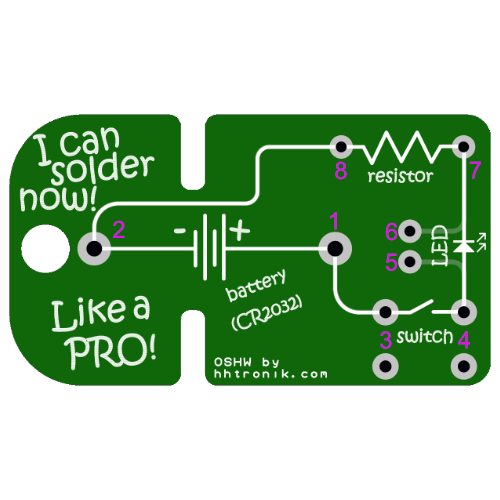
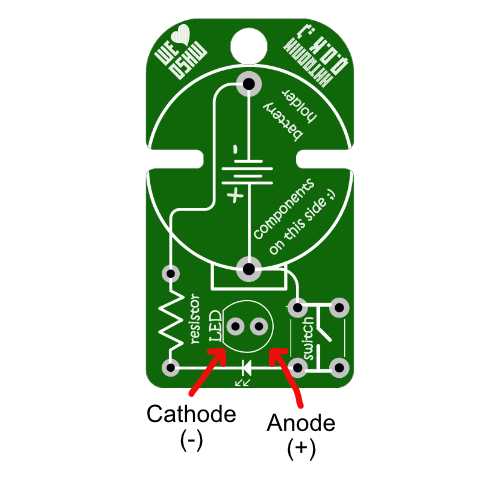

HHTronik Q.O.K. / I learn soldering
===================================


Want to learn soldering? Then this is for you! **I learn soldering** is a super simple kit designed to give you a (relatively) pain-free crash course in that topic!
This version of the I learn soldering kit is using only so-called through-hole components, meaning that all components have leads you stick through drill hits in the PCB and then solder the leads.
If you'd like to look into something more challenging (perhaps ;) we have a SMD version of this too: [I lean soldering SMD Q.O.K.](https://github.com/hhtronik/qok-i-learn-soldering-smd)


When completed you'll have soldered this circuit:

```

	            battery
	           + | |  -
	+------------||||---------------+
	|            | |                |
	|                               |
	|    _                          |
	+---/  ------->|-----/\/\/\-----+
	  switch     LED    resistor

```

...which is basically the most simple flash light circuit you can think of. Press the switch and current flows from the battery through the resistor and the LED, lighting it up! 

What equipement do I need?
--------------------------

- A soldering iron
- Some solder
- A side-cutter / snips
- Patience if this is your first time soldering

As always, work safety is important, so don't burn yourself and don't inhale the fumes released while soldering. Working in a well ventilated area is good. We'd definitely recommend adding some ventilation (for example a fan of some sort blowing the fumes away from you or a proper soldering fume extractor if you plan on doing this over and over again :)

Optionally you may have these things around:

- some flux
- rubbing alcool or isopropanol
- some lint-free cloth / paper towel
- a multimeter (ideally with a diode test mode)

Assembly mini guide
-------------------

> It's technically possible to solder the circuit "upside-down", hence why we added a small `components on this side` indication to the silkscreen! 

1. Clean the PCB with some rubbing alcool and the cloth *(optional but recommended)*
2. Populate the resistor (this means bending the pins, and sticking them through the pads close to the label "resistor", you can use the slots in the PCB as spacer to bend the lead wires at the right place :)
3. Solder one pad (hold the tip of the soldering iron against the PCB pad **and** the lead wire for 2-3 seconds, add a bit of solder then retract solder first, finally retract iron, you'll get used to that routine fast!)
4. Check proper seating of the resistor (it should be sitting flat and centered between it's two pads)
5. Solder the second pad
6. Insert the LED to it's pads leaving some length of lead wire so you could bend over the LED and have it pointing forward instead of up **Watch out the note on LED polarization below!**
7. Solder it as you did with the resistor
8. Insert and solder the switch (the switch has an orientation too, it can be inserted easily in one direction without twisting the lead wires)
9. Insert and solder the battery holder (the outline of the battery holder should match the silkscreen printing)
10. Check all joints (and measure everything if you know how to do that)
11. Use the side-cutter to remove the excess wire (maybe do that once you've tested everything _/\O/\_ )
11. Insert a battery (the positive pole/+ should face up, away from the PCB) and press the button

**...if the LED lights up, well, congratulations you've completed the kit!**

Troubleshooting
----------------

First of all, this is not a bad thing! The real fun actually just begun. Here are some things you want to check:



- Check if the battery is inserted the right way around (the + sign should be touching the battery holder)
- Check the battery voltage with the multimeter (should be > 2.5V ideally)
- Check all solder joints
- Measure from point to point (testing order matters, start with the fist points):

| Pads / Test points | Multimeter mode       | Expected result            | Repairing it               |
| ------------------ | --------------------- | -------------------------- | -------------------------- |
| `1` to `3` | `Continuity` or `resistance`  | Continuity or < 5 Ohms in resistance test | check the solder joints on the battery holder and switch |
| `1` to `5` | `continuity` or `resistance`  | Continuity (or < 5 Ohms in resistance test) when you press the button | Check the solder joints on the switch |
| `1` to `5` | `continuity` or `resistance`  | No continuity (or O.L. / inifinite resistance) when the button is not pressed | Check for solder bridges arround on the switch |
| `4` to `7` | `diode test`                  | With the positive terminal on `4` and COM/Negative on `7` the LED is expected to turn on. If swapping connections makes the LED light... | ...de- then re-solder the LED after flipping polarity. |
| `6` to `8` | `resistance`                  | The meter should read approx. 50 Ohm | Verify the solder joints. 


Polarity of LEDs
----------------

**LEDs are polarized components.** This means that their orientation matters. 

Most through hole LEDs have a "cathode mark" which indicates where their "negative pin" is, which is componly 
shown by a flat spot in the LED casing. In 99% of the cases the cathode lead wire is a few mm shorter than the other one too!

The PCB footprint for the LED does mark the cathod too (the flat spot in the silkscreen print) so you should align those.



Components
----------

| Reference        | Part                        | Notes / Alternative parts  |
| ---------------- | --------------------------- | -------------------------- |
| Battery holder   | `MPD BS-7`                  | `Keystone 106`
| Switch           | `C&K PTS645SL50-2`          | 
| LED              | `QTB QBL8R30C`              | Pretty much any 5mm size high brightness red LED
| Resistor         | `Stackpole CF14JT51R0`      | Resistor value in kit: 51 Ohm.


The acceptable value range for the resistor depends on the current rating of the LED. The`QTB QBL8R30C` is rated for 20mA nominal forward current and has a forward voltage of about 2V.
This means that any resistor bigger than 50 Ohm would we limit the current to 20mA or below with a fresh CR2032 battery.


I don't know anything about electronics, what can I learn?
----------------------------------------------------------

Plenty! Besides the art of soldering (there's a list of useful Youtube clips on how to solder below) you could try to learn more about the characteristics of resistors or LEDs to
get an understanding for why we need the resistor in this circuit ;) 

If, for example, you'd like to buy another resistor to get a few more photons out of that LED, you could use the formula below to calculate what resistance value results in which current or vice-versa:

```
	Vf  = LED forward voltage = 2.0V (for a typical "high brightness" red LED)
	If  = LED current
	Vcc = battery voltage = 3.0V (for a fresh CR20xx cell)
	R 	= Resistor value

	Calculating R
	-------------

	    Vcc - Vf
	R = --------
	       If

	Calculating If
	--------------

	     Vcc - Vf
	If = --------
            R
```

Want to know why you actually need current limiting the LED? Here's a great writeup: [LED Current Limiting Resistors on Sparkfun.com](https://www.sparkfun.com/tutorials/219)

Watch others do
---------------

Some SMT soldering tutorials worth watching if you've never done this before

[ifixit / Basic Skills!: Basic soldering ~ 2min](https://www.youtube.com/watch?v=UpVx4wGukRc)

[Collin's Lab / Soldering ~ 5min](https://www.youtube.com/watch?v=QKbJxytERvg)

[Pace worldwide / Basic soldering lesson 1 "Solder and flux" ~ 21min](https://www.youtube.com/watch?v=vIT4ra6Mo0s)


LICENCE
-------

This project is licenced under CERN Open Hardware Licence Version 2 - Strongly Reciprocal see LICENCE file for the full text.